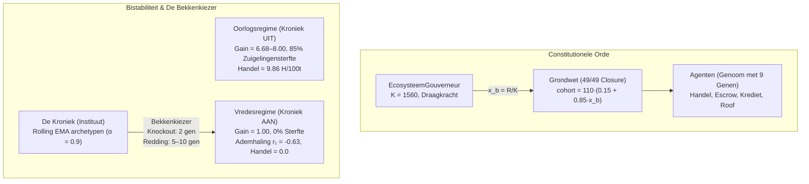

# EvoAgora: De Kroniek als Bekkenkiezer
### Institutioneel geheugen, demografische pulsen en de ondeelbare instelling in een evolutionaire agenteneconomie

[](LICENSE)
[](https://www.python.org/downloads/)
[](evo_agents/MANUSCRIPT_DE_KRONIEK_ALS_BEKKENKIEZER.md)

**EvoAgora** is een deterministische, multi-agent synthetische economie waarin kortlevende agenten met genetische gedragsparameters, begrensd individueel geheugen en concave nuttigheden onderhandelen, handelen, roven en reproduceren onder een constitutionele populatiegate.

Het project onderzoekt de opkomst, stabiliteit en overdracht van beschaving en instituties via een collectief archetypen-geheugen (**De Kroniek**).

📖 **Lees het volledige wetenschappelijke manuscript:** [MANUSCRIPT_DE_KRONIEK_ALS_BEKKENKIEZER.md](evo_agents/MANUSCRIPT_DE_KRONIEK_ALS_BEKKENKIEZER.md)

---

## 🌟 Belangrijkste Wetenschappelijke Resultaten



1. **Constitutionele Sluiting (49/49):** De demografie is een zuivere functie van de ecologische grensvullingsgraad ($x_b = R/K$). Alle 49 getoetste registerrijen sluiten exact op de agent ($\varepsilon = -0{,}02$).
2. **Bistabiliteit van Beschaving:** Het systeem kent twee dynamische bekkens:
   - **Het Oorlogsbekken:** Boom-bust Volterra-puls, cohortversterking $\text{Gain} = 6{,}7\text{–}8{,}0$, $85\%$ zuigelingensterfte, mediane levensduur $51$ ticks.
   - **Het Vredesbekken:** Stationaire stroom, cohortversterking $\text{Gain} = 1{,}00$, $0\%$ zuigelingensterfte, levensduur $300$ ticks, getemde ademhaling ($r_1 = -0{,}63$).
3. **De Kroniek als Bekkenkiezer:** Institutioneel geheugen is een **discrete bekkenkiezer**, geen dimmer. Uitschakeling collabeert vrede in **2 generaties**; herinjectie herstelt haar in **5–10 generaties**, zonder hysterese of institutionele veroudering.
4. **De Wet van Ondeelbaarheid (AND-structuur, $N=30\times3$):** 
   - Arm W (alleen strafregister / waarschuwingen): $40\%$ transplantatiesucces ($60\%$ censuur).
   - Arm P (alleen vertrouwensregister / priors): $53\%$ transplantatiesucces ($47\%$ censuur).
   - Arm F (volledig archief): **$100\%$ transplantatiesucces** ($5{,}17 \pm 0{,}65$ generaties).
   - Fisher's exact toets t.o.v. Arm F: **$p = 1{,}87 \times 10^{-7}$** (W) en **$p = 1{,}68 \times 10^{-5}$** (P).
5. **Natuurkunde van de Ademhaling:** AR(2)-polen liggen strikt binnen de eenheidscirkel ($|r| = [0{,}765, 0{,}233] < 1{,}00$). Vrede is een **gedwongen gedempte oscillator**; De Kroniek fungeert als dissipatieve schokdemper tegen stochastische omgevingsruis.
6. **Montesquieu-inversie:** Handelsvolume is een heterogeniteitsindicator, geen welvaartsindicator ($0{,}0$ H/100t in vrede vs $9{,}86$ H/100t in oorlog).
7. **De Asymmetrie-Wet van Institutionele Tijd:**
   $$\mathbf{\text{verliezen }(2\text{ gen}) \;<\; \text{transplanteren }(5{,}2) \;\approx\; \text{herstellen }(5\text{–}10) \;\ll\; \text{kweken }(\sim180)}$$

---

## 📂 Mappenstructuur

```
peaceful-hubble/
├── README.md                                   # Dit overzicht
└── evo_agents/                                 # De simulatie- en experimentele suite
    ├── MANUSCRIPT_DE_KRONIEK_ALS_BEKKENKIEZER.md # Het definitieve wetenschappelijke artikel
    ├── evolib/                                 # Domein-, economie- en telemetriebibliotheek
    │   ├── agent.py                            # Agent-state, voorraden, metabolisme
    │   ├── ecosystem.py                        # EcosysteemGouverneur (draagkracht, poorten)
    │   ├── evolution.py                        # Genetische operatoren & clusterselectie
    │   ├── genome.py                           # 9-genig genoom & mutatiemodel
    │   ├── memory.py                           # Geheugenlagen (episodisch, sociaal, kroniek)
    │   ├── policy.py                           # Concaaf nut, prijzen, concessiecurven
    │   ├── protocol.py                         # HMAC-notaris, escrow, krediet
    │   ├── telemetry.py                        # LTTB-downsampling, Gini, Shannon, observator
    │   ├── dashboard_dash.py                   # Plotly/Dash interactieve cockpit
    │   ├── viz_matplotlib.py                   # Matplotlib realtime viewer
    │   └── world.py                            # Wereld-tick, interacties, logistiek
    ├── run_dashboard.py                        # Unified launcher voor dashboard & visualisaties
    ├── run_oxalpha_synthesis.py                # AR(2)-polen fit & Gen 0 calibratie
    ├── run_decomposition_n30.py                # N=30 Decompositie-replicatie & Fisher toetsen
    ├── run_peace_knockout.py                   # Vredesknockout- & herstelexperiment
    └── volwassen_kroniek.pkl                   # Gecachte snapshot van volwassen Kroniek (gen 180)
```

---

## 🚀 Snelle Start

### 1. Installatie
```bash
cd evo_agents
pip install -r requirements.txt
```

### 2. Interactief Visualisatie-Dashboard (Dash Cockpit)
Start de interactieve browser-cockpit op `http://127.0.0.1:8050`:
```bash
python run_dashboard.py --modus dash --seed 42 --poort 8050
```
Het dashboard biedt:
* **Ruimtelijke Kaart:** Realtime posities van agenten, voedsel- en ertsbronnen.
* **Tijdsreeksen:** EHI, cohortgrootte, Gini-ongelijkheid, parasitisme $\bar{P}$ en coöperatie $\kappa$.
* **Faseportretten:** $\bar{P}$ vs. EHI fasevlak (Lotka-Volterra oscillaties).
* **Historische Replay:** Scrub door opgenomen runs (`.jsonl`).

### 3. Matplotlib Realtime Viewer
```bash
python run_dashboard.py --modus live --seed 42
```

### 4. Wetenschappelijke Experimenten Reproduceren
```bash
# AR(2)-polen en Holling-subsistentie calibratie
python run_oxalpha_synthesis.py

# N=30 Decompositie-replicatie (W vs P vs F)
python run_decomposition_n30.py

# Vredesregime Knockout & Herstel
python run_peace_knockout.py
```

---

## 📜 Citeren
```bibtex
@article{oxalpha2026kroniek,
  title={De Kroniek als Bekkenkiezer: Institutioneel geheugen, demografische pulsen en de ondeelbare instelling in een evolutionaire agenteneconomie},
  author={OxAlpha and Co-researchers},
  journal={Synthetische Agora Working Papers},
  year={2026}
}
```
